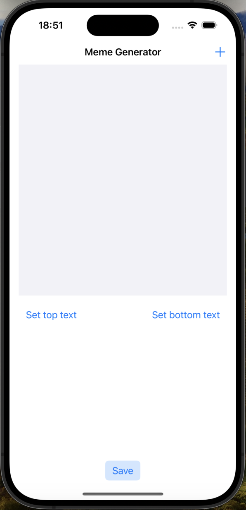
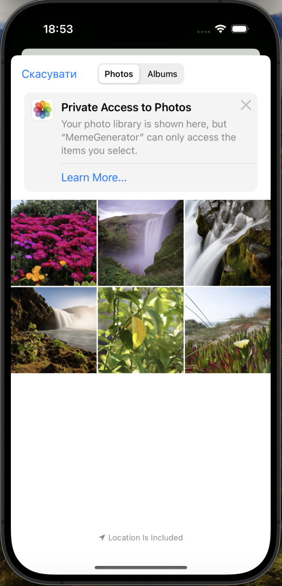
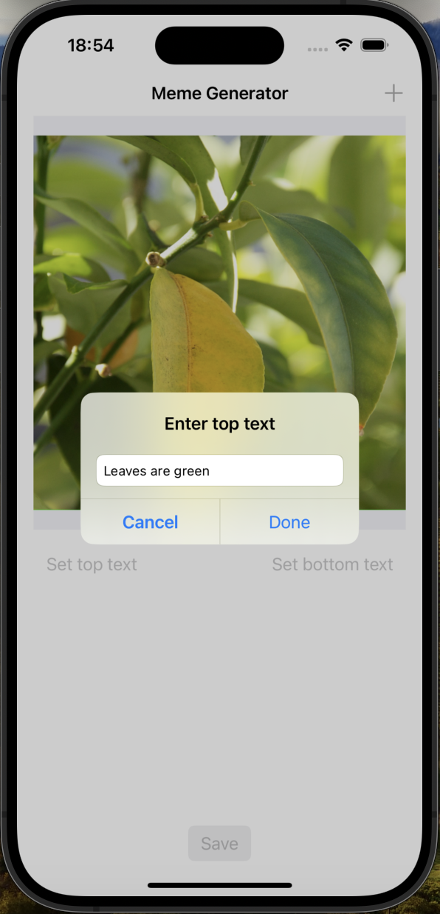
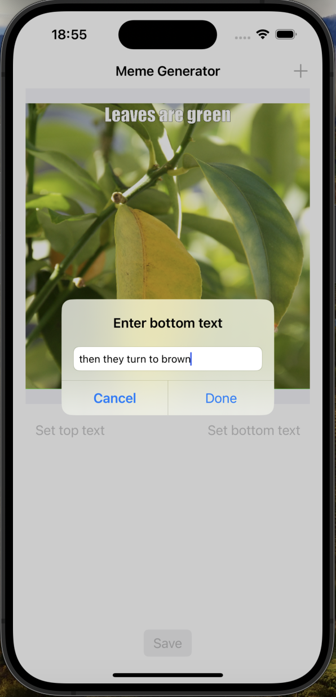
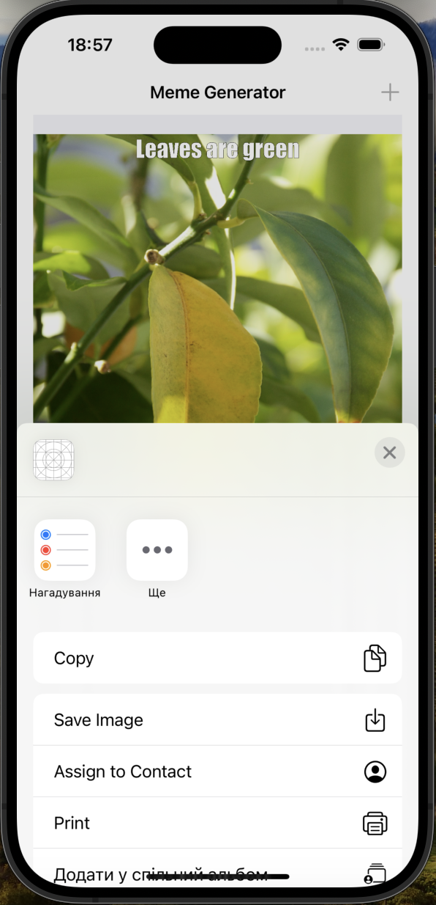

# MemeGenerator

MemeGenerator is a fun application that allows users to create memes by adding text to their photos. Users can import pictures, add top and bottom text, and save or share their memes directly from the app.

## Features

- Import images from the photo library
- Add text to the top and bottom of the image
- Save the meme to the photo library
- Share the meme using the iOS share sheet

## Usage

1. Launch the application.
2. Tap the "+" button to import a picture from your photo library.
3. Tap the "Set Top Text" button to add text to the top of the image.
4. Tap the "Set Bottom Text" button to add text to the bottom of the image.
5. Tap the "Save" button to save the meme to your photo library or share it.

## Screenshots

### Main Screen

### Import Picture

### Add Top Text

### Add Bottom Text

### Save or Share Meme

## Possible Improvements

- Add the ability to resize and reposition text.
- Allow users to choose different fonts and colors for the text.
- Enable users to draw on the image or add stickers.
- Implement cloud synchronization to save and access memes across multiple devices.
- Enhance the UI with custom themes and a more modern design.
